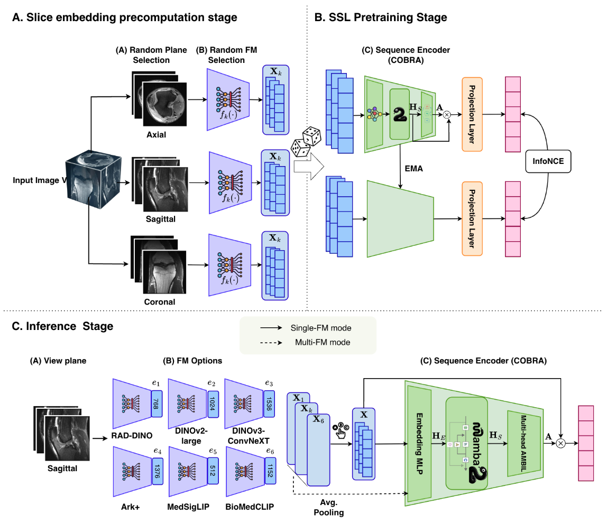

## Recall

Last time we discussed the broad direction of the publication and the next steps.

- [x] Task 1: MoE or multiple random passes (explainability, confidence score) 
- [x] Task 2: Compare MedSliM with MRNet / MST / 3DINO
- [ ] Task 3: Scale training data 
- [x] Task 4: How many foundation models needed?
- [x] Task 5: More anatomical regions
- [ ] Optiomal tasks: Look into interpretability by tracing back the slice weights in Mamba block and check RAPTOR performance and spatial tokens implementation if having spare time and space to put into the journal

## Cross-FM random pair vs Router subset SSL

::: {.columns .router-diagram}

::: {.column width="50%"}

::: {.router-img-wrap}
{.router-overview}
:::

::: {.router-caption}
(a) Cross-FM random pair
:::

:::

::: {.column width="50%"}

::: {.router-img-wrap}
{.router-overview}
:::

::: {.router-caption}
(b) Router subset SSL
:::

:::

:::

## Detailed FM Router Architecture

::: {.centered-figure}

:::

## Q1. Router subset SSL vs cross-FM random pair — which is better?

| SSL paradigm | Pretrain data  | Pretrain FMs | Eval FMs | Pooling target | AUROC (mean ± std) | AUPRC (mean ± std) |
|----------|:---------------:|:----------:|:----------:|:-------:|:-------:|
| **cross-FM random pair** | MRNet | `mri-core, curia, medimageinsight` | raw `mri-core` | 0.7112 ± 0.0193 | 0.4534 ± 0.0097 |
| **cross-FM random pair** | MRNet+fastMRI+KMAR | `mri-core, curia, medimageinsight` | raw `mri-core` | **0.7624 ± 0.0187** | **0.5001 ± 0.0113** |
| **Router subset (subset K=4)** | MRNet | `mri-core, medimageinsight, curia` | post-router-aggregated embeddings | 0.7114 ± 0.0221 | 0.4385 ± 0.0182 |
| **Router subset (subset K=4)** | MRNet+fastMRI+KMAR | `mri-core, medimageinsight, curia` | post-router-aggregated embeddings | 0.0.7252 ± 0.0310 | 0.5435 ± 0.0379 |
