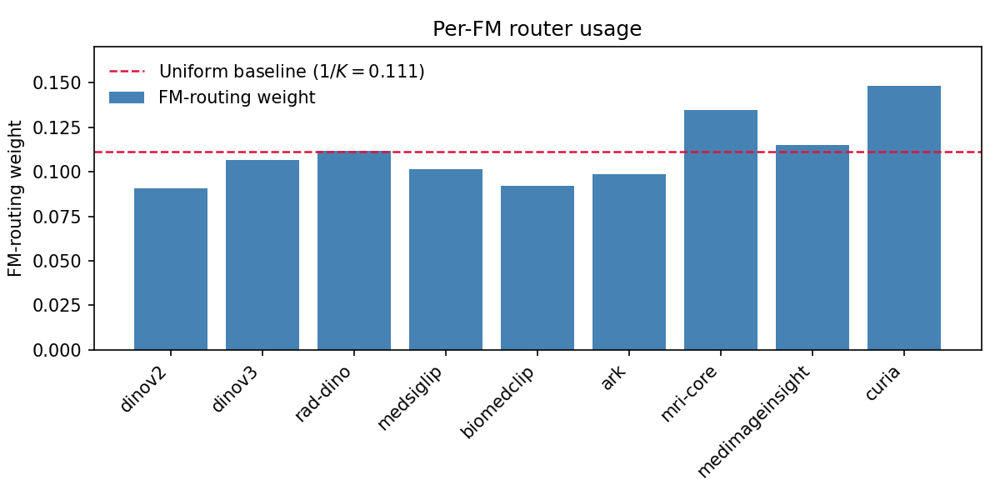

## Recall

Last time we discussed the broad direction of the publication and the next steps.

- [x] Task 1: MoE or multiple random passes (explainability, confidence score) 
- [x] Task 2: Compare MedSliM with MRNet / MST / 3DINO
- [x] Task 3: Scale training data 
- [x] Task 4: How many foundation models needed?
- [x] Task 5: More anatomical regions
- [ ] Optiomal tasks: Look into interpretability by tracing back the slice weights in Mamba block and check RAPTOR performance and spatial tokens implementation if having spare time and space to put into the journal

## Cross-FM random pair vs Router subset SSL

::: {.columns .router-diagram}

::: {.column width="50%"}

::: {.router-img-wrap}
{.router-overview}
:::

::: {.router-caption}
(a) Cross-FM random pair
:::

:::

::: {.column width="50%"}

::: {.router-img-wrap}
{.router-overview}
:::

::: {.router-caption}
(b) Router subset SSL
:::

:::

:::

## Detailed FM Router Architecture

::: {.centered-figure}

:::


## Overview of pretrained FM models used in the ablation study

<table class="fm-overview-table">
  <thead>
    <tr>
      <th>Group</th>
      <th>Model</th>
      <th>Category</th>
      <th>Encoder</th>
      <th>Model Params</th>
      <th>Embed Dim.</th>
    </tr>
  </thead>
  <tbody>
    <tr class="fm-group-general">
      <td rowspan="2" class="fm-group-label">General domain</td>
      <td><a href="https://arxiv.org/abs/2304.07193">DINOv2</a></td>
      <td>Vision-only</td>
      <td>ViT-L</td>
      <td>300M</td>
      <td>1024</td>
    </tr>
    <tr class="fm-group-general">
      <td><a href="https://arxiv.org/abs/2508.10104">DINOv3</a></td>
      <td>Vision-only</td>
      <td>ViT-L</td>
      <td>300M</td>
      <td>1024</td>
    </tr>
    <tr class="fm-group-med-general">
      <td rowspan="3" class="fm-group-label">Medical domain<br>(General)</td>
      <td><a href="https://arxiv.org/abs/2303.00915">BioMedCLIP</a></td>
      <td>VLM</td>
      <td>ViT-B</td>
      <td>86M</td>
      <td>512</td>
    </tr>
    <tr class="fm-group-med-general">
      <td><a href="https://arxiv.org/abs/2507.05201">MedSigLIP</a></td>
      <td>VLM</td>
      <td>SoViT</td>
      <td>400M</td>
      <td>1152</td>
    </tr>
    <tr class="fm-group-med-general">
      <td><a href="https://arxiv.org/abs/2410.06542">MedImageInsight</a></td>
      <td>VLM</td>
      <td>DaViT</td>
      <td>360M</td>
      <td>1024</td>
    </tr>
    <tr class="fm-group-cxr">
      <td rowspan="2" class="fm-group-label">Medical domain<br>(2D-CXR-specific)</td>
      <td><a href="https://arxiv.org/abs/2401.10815">RAD-DINO</a></td>
      <td>Vision-only</td>
      <td>ViT-B</td>
      <td>86M</td>
      <td>768</td>
    </tr>
    <tr class="fm-group-cxr">
      <td><a href="https://pubmed.ncbi.nlm.nih.gov/41319624/">Ark+</a></td>
      <td>Vision-only</td>
      <td>Swin-L</td>
      <td>197M</td>
      <td>1536</td>
    </tr>
    <tr class="fm-group-mri">
      <td class="fm-group-label">Medical domain<br>(3D-MRI-specific)</td>
      <td><a href="https://arxiv.org/abs/2506.12186">MRI-CORE</a></td>
      <td>Vision-only</td>
      <td>ViT-B</td>
      <td>86M</td>
      <td>768</td>
    </tr>
    <tr class="fm-group-ct-mri">
      <td rowspan="3" class="fm-group-label">Medical domain<br>(3D-CT/MRI-specific)</td>
      <td><a href="https://arxiv.org/abs/2509.06830">Curia</a></td>
      <td>Vision-only</td>
      <td>ViT-L</td>
      <td>300M</td>
      <td>1024</td>
    </tr>
    <tr class="fm-group-ct-mri">
      <td><a href="https://arxiv.org/abs/2604.01987">Curia-2</a></td>
      <td>Vision-only</td>
      <td>ViT-L</td>
      <td>303M</td>
      <td>1024</td>
    </tr>
    <tr class="fm-group-ct-mri">
      <td><a href="https://arxiv.org/abs/2509.02379">MedDINOv3</a></td>
      <td>Vision-only</td>
      <td>ViT-B</td>
      <td>86M</td>
      <td>768</td>
    </tr>
    <tr class="fm-group-ct">
      <td class="fm-group-label">Medical domain<br>(3D-CT-specific)</td>
      <td><a href="https://arxiv.org/abs/2605.21906">FlexiCT-2D</a></td>
      <td>Vision-only</td>
      <td>ViT</td>
      <td>144M</td>
      <td>864</td>
    </tr>
  </tbody>
</table>

## Q1. Router subset SSL vs cross-FM random pair — which is better?

Controlled comparison between cross-FM random pair and Router subset SSL: 

1. Pretrained on MRNet
2. FMs used in the pretraining: DINOv2, DINOv3, RAD-DINO, MedSigLip, BioMedCLIP, Ark+, MRI-CORE, MedImageInsight, Curia.
3. Pooling target: raw MRI-CORE embedding

::: {.table-with-note}

<table class="ablation-metric-table">
  <thead>
    <tr>
      <th rowspan="2">Eval FMs</th>
      <th colspan="2">Cross-FM random pair</th>
      <th colspan="2">Router subset (subset K=4)<sup>†</sup></th>
    </tr>
    <tr>
      <th>AUROC</th>
      <th>AUPRC</th>
      <th>AUROC</th>
      <th>AUPRC</th>
    </tr>
  </thead>
  <tbody>
    <tr>
      <td class="eval-fms"><strong>1</strong> (<code>mri-core</code>)</td>
      <td>0.7037 ± 0.0545</td>
      <td>0.4321 ± 0.0354</td>
      <td><strong>0.7485 ± 0.0041</strong> <span class="delta">(+4.5 pp)</span></td>
      <td><strong>0.4857 ± 0.0234</strong> <span class="delta">(+5.4 pp)</span></td>
    </tr>
    <tr>
      <td class="eval-fms"><strong>3</strong> (<code>mri-core, curia, medimageinsight</code>)</td>
      <td>0.7267 ± 0.0041</td>
      <td>0.4790 ± 0.0133</td>
      <td><strong>0.7443 ± 0.0066</strong> <span class="delta">(+1.8 pp)</span></td>
      <td><strong>0.5015 ± 0.0352</strong> <span class="delta">(+2.3 pp)</span></td>
    </tr>
    <tr>
      <td class="eval-fms"><strong>9</strong> (all FMs used in pretraining)</td>
      <td>0.7041 ± 0.0386</td>
      <td>0.4372 ± 0.0239</td>
      <td><strong>0.7226 ± 0.0110</strong> <span class="delta">(+1.9 pp)</span></td>
      <td><strong>0.4698 ± 0.0369</strong> <span class="delta">(+3.3 pp)</span></td>
    </tr>
  </tbody>
</table>

::: {.table-footnote}
<sup>†</sup> Values in parentheses are Δ = router SSL score − pair SSL score (percentage points).
:::

:::


## Q1. Interpretability of FM router weights

::: {.centered-figure}
{.router-usage-fig fig-alt="Bar chart of per-FM router usage; Curia and MRI-CORE exceed the uniform 1/K baseline."}
:::

- **Curia** and **MRI-CORE** dominate above the uniform $1/K$ baseline; general-domain FMs remain under-weighted
- The pretrained router learns the relative importance of different FMs for knee MRI
- Consistent with our 2D FM benchmarking conclusion of a **generalization–specialization trade-off**


## Q2. How many FMs are needed for the best performance?

Controlled comparison: Cross-FM-random-pair SSL · LP on raw `mri-core` (unless noted) · pretrained on MRNet · eval on kneeMRI ACL

::: {.table-with-note}

<table class="fm-count-table">
  <thead>
    <tr>
      <th>Number of FMs used in pretraining</th>
      <th>Domain</th>
      <th>AUROC</th>
      <th>AUPRC</th>
    </tr>
  </thead>
  <tbody>
    <tr class="fm-domain-natural">
      <td class="pretrain-fms">2<br>(DINOv2, DINOv3)</td>
      <td class="domain-label">Natural imaging generalist</td>
      <td>0.5962 ± 0.0450<sup>†</sup></td>
      <td>0.3964 ± 0.0433<sup>†</sup></td>
    </tr>
    <tr class="fm-domain-mri">
      <td class="pretrain-fms">3<br>(MedImageInsight, MRI-CORE, Curia)</td>
      <td class="domain-label">MRI-specialist</td>
      <td><strong>0.7454 ± 0.0227</strong></td>
      <td><strong>0.4941 ± 0.0401</strong></td>
    </tr>
    <tr class="fm-domain-dino">
      <td class="pretrain-fms">5<br>(DINOv2, DINOv3, RAD-DINO, MRI-CORE, Curia)</td>
      <td class="domain-label">DINO-family</td>
      <td>0.7022 ± 0.0080</td>
      <td>0.4443 ± 0.0149</td>
    </tr>
    <tr class="fm-domain-radio">
      <td class="pretrain-fms">5<br>(MedImageInsight, MRI-CORE, Curia, Ark+, RAD-DINO)</td>
      <td class="domain-label">Radiology-specialist</td>
      <td>0.6984 ± 0.0299</td>
      <td>0.4481 ± 0.0208</td>
    </tr>
    <tr class="fm-domain-mixed">
      <td class="pretrain-fms">6<br>(DINOv2, RAD-DINO, DINOv3, MedSigLIP, BioMedCLIP, Ark+)</td>
      <td class="domain-label">Mixed without MRI-specialist</td>
      <td><u>0.7235 ± 0.0032</u></td>
      <td>0.4599 ± 0.0203</td>
    </tr>
    <tr class="fm-domain-med-general">
      <td class="pretrain-fms">7<br>(RAD-DINO, MedSigLIP, BioMedCLIP, Ark+, MRI-CORE, MedImageInsight, Curia)</td>
      <td class="domain-label">Medical generalist</td>
      <td>0.7168 ± 0.0048</td>
      <td><u>0.4636 ± 0.0050</u></td>
    </tr>
  </tbody>
</table>

::: {.table-footnote}
<sup>†</sup> MedImageInsight (1024-D) as the pooling target instead. MRI-CORE probing is unavailable here because pretraining did not include a 768-D projection head.
:::

::: {.callout-note .fm-agnostic-callout .fm-count-callout}
## Why unseen FMs work at inference?

1. **LayerNorm** maps heterogeneous FM features to a shared scale before projection
2. **[Platonic / Anna Karenina](https://arxiv.org/html/2405.07987v4):** strong models converge to similar representations, so an unseen FM can reuse a same-dim head learned by a related FM
:::

::: {.callout-warning .fm-agnostic-callout .fm-count-callout}
## Dimensionality compatibility constraint

`per_dim` EmbedMLP learns one head per embed dim — reuse only if that dim was seen in pretraining (e.g. MRI-CORE 768-D after RAD-DINO; MedImageInsight 1024-D via DINOv2). The 2-FM natural-imaging run has no 768-D head → MRI-CORE probing fails.
:::

:::

## Q2. Takeaways: pretraind FM domain composition matters more than number of FMs

**More FMs ≠ better:** *who* is in the FM set matters more than *how many* FMs.

- 3-MRI trio > 6-mixed w/o MRI ≈ 7 medical generalist > 5 DINO-family / radiology-specialist ≫ 2-natural-imaging generalist
- Broad mixes without MRI specialists during pretraining can still transfer with shared 768-D head using `mri-core` as pooling target, but do **not** beat the curated MRI trio.
- Extra VLMs can dilute a tight MRI contrastive set; natural-imaging generalist SSL remains weak when no medical/MRI FM participates


## Q3. MedSliM compared to supervised / voxel SSL models

Controlled comparison:
- Evaluation on sagittal kneeMRI dataset with ACL severity classification
- MedSliM checkpoints are pretrained on **MRNet training set only**.

```{python}
#| echo: false
#| freeze: false

import numpy as np
import plotly.graph_objects as go
from IPython.display import HTML, display

fracs = np.array([0.10, 0.25, 0.50, 0.75, 1.00])
LINE_W, LINE_W_HOVER = 2.4, 4.8
# Plotly only hits markers by default; dense samples make the whole polyline hoverable.
N_HOVER = 100
x_hover = np.linspace(fracs.min(), fracs.max(), N_HOVER)

# MRNet-only MedSliM (router = 16-17:51 @ MRI trio throughout)
series = {
    "MRNet (ACL)": dict(
        y=[0.863, 0.874, 0.867, 0.863, 0.859],
        e=[0.012, 0.008, 0.012, 0.005, 0.004],
        marker="circle", color="#f4d35e", dash="solid",
    ),
    "MRNet (abnormal)": dict(
        y=[0.632, 0.685, 0.698, 0.715, 0.732],
        e=[0.083, 0.027, 0.020, 0.012, 0.004],
        marker="square", color="#ee964b", dash="solid",
    ),
    "MST": dict(
        y=[0.549, 0.582, 0.634, 0.658, 0.654],
        e=[0.047, 0.070, 0.045, 0.036, 0.028],
        marker="triangle-up", color="#9b9b9b", dash="solid",
    ),
    "3DINO": dict(
        y=[0.648, 0.669, 0.683, 0.735, 0.758],
        e=[0.051, 0.049, 0.060, 0.055, 0.048],
        marker="diamond", color="#7eb6d9", dash="solid",
    ),
    "MedSliM (cross-FM pair SSL)": dict(
        y=[0.570, 0.651, 0.683, 0.747, 0.745],
        e=[0.096, 0.065, 0.008, 0.016, 0.023],
        marker="triangle-down", color="#e76f51", dash="solid",
    ),
    "MedSliM (FM-router subset SSL)": dict(
        y=[0.601, 0.681, 0.719, 0.714, 0.744],
        e=[0.064, 0.064, 0.016, 0.027, 0.007],
        marker="cross", color="#2a9d8f", dash="solid",
    ),
}


def hex_to_rgba(hex_color: str, alpha: float) -> str:
    hex_color = hex_color.lstrip("#")
    r, g, b = (int(hex_color[i:i + 2], 16) for i in (0, 2, 4))
    return f"rgba({r},{g},{b},{alpha})"


fig = go.Figure()

for name, s in series.items():
    y = np.asarray(s["y"], dtype=float)
    e = np.asarray(s["e"], dtype=float)
    upper, lower = y + e, y - e

    # Shaded ±std band (no hover); shares legendgroup with mean curve
    fig.add_trace(
        go.Scatter(
            x=np.concatenate([fracs, fracs[::-1]]),
            y=np.concatenate([upper, lower[::-1]]),
            fill="toself",
            fillcolor=hex_to_rgba(s["color"], 0.18),
            line=dict(color="rgba(0,0,0,0)", width=0),
            hoverinfo="skip",
            showlegend=False,
            legendgroup=name,
        )
    )

    # Invisible dense capture along the polyline: highlight only (no tooltip).
    # hoverinfo="none" still fires plotly_hover; "skip" would not.
    y_h = np.interp(x_hover, fracs, y)
    fig.add_trace(
        go.Scatter(
            x=x_hover,
            y=y_h,
            mode="lines+markers",
            name=name,
            legendgroup=name,
            meta="hover",
            showlegend=False,
            line=dict(width=18, color="rgba(0,0,0,0)"),
            marker=dict(size=12, color=s["color"], opacity=0),
            hoverinfo="none",
        )
    )

    # Visible mean curve on top so data-point markers win: hover showing tooltips
    fig.add_trace(
        go.Scatter(
            x=fracs,
            y=y,
            mode="lines+markers",
            name=name,
            legendgroup=name,
            meta="mean",
            line=dict(color=s["color"], width=LINE_W, dash=s["dash"]),
            marker=dict(
                symbol=s["marker"],
                size=10,
                color=s["color"],
                line=dict(color="white", width=0.6),
            ),
            customdata=np.column_stack([e]),
            hovertemplate=(
                "<b>%{fullData.name}</b><br>"
                "Training fraction: %{x:.2f}<br>"
                "AUROC: %{y:.3f} ± %{customdata[0]:.3f}"
                "<extra></extra>"
            ),
        )
    )

fig.update_layout(
    template="plotly_dark",
    paper_bgcolor="#1a1a1a",
    plot_bgcolor="#1a1a1a",
    width=1100,
    height=420,
    margin=dict(l=60, r=240, t=20, b=50),
    xaxis=dict(
        title="Fraction of training data",
        tickmode="array",
        tickvals=fracs,
        ticktext=[f"{f:g}" for f in fracs],
        gridcolor="rgba(255,255,255,0.18)",
        zeroline=False,
    ),
    yaxis=dict(
        title="macro-AUROC",
        range=[0.48, 0.92],
        gridcolor="rgba(255,255,255,0.18)",
        zeroline=False,
    ),
    legend=dict(
        orientation="v",
        yanchor="middle",
        y=0.5,
        xanchor="left",
        x=1.02,
        bgcolor="rgba(0,0,0,0)",
        borderwidth=0,
        font=dict(size=11),
        # Legend hover also dims other series (Plotly built-in)
        itemclick="toggle",
        itemdoubleclick="toggleothers",
    ),
    hovermode="closest",
)

# Highlight hovered series (line + band); dim the rest. Plotly has no native API for this.
_post_script = f"""
(function() {{
  var gd = document.getElementById('{{plot_id}}');
  if (!gd) return;
  var baseW = {LINE_W}, hoverW = {LINE_W_HOVER};

  function applyHighlight(activeGroup) {{
    var opacities = [];
    var widths = [];
    for (var i = 0; i < gd.data.length; i++) {{
      var tr = gd.data[i];
      var active = (activeGroup === null) || (tr.legendgroup === activeGroup);
      opacities.push(active ? 1 : 0.12);
      // Only restyle the visible mean curves (not the wide invisible hover capture)
      if (tr.meta === 'mean') {{
        widths.push(active && activeGroup !== null ? hoverW : baseW);
      }} else if (tr.meta === 'hover') {{
        widths.push(18);
      }} else {{
        widths.push(0);
      }}
    }}
    Plotly.restyle(gd, {{'opacity': opacities, 'line.width': widths}});
  }}

  gd.on('plotly_hover', function(data) {{
    if (!data || !data.points || !data.points.length) return;
    applyHighlight(gd.data[data.points[0].curveNumber].legendgroup);
  }});
  gd.on('plotly_unhover', function() {{ applyHighlight(null); }});
}})();
"""

display(
    HTML(
        fig.to_html(
            include_plotlyjs=True,
            full_html=False,
            config={"displayModeBar": False, "responsive": True},
            post_script=_post_script,
        )
    )
)
```

::: {.callout-note .fm-agnostic-callout}
## Model roles in this comparison

- **MedSliM (cross-FM pair SSL)**: MRI-trio uses in pretraining with MRI-CORE as pooling target in linear probing
- **MedSliM (FM-router subset SSL)**: all FMs listed in overview excluding CT-specific FMs uses in pretraining with MRI-trio as pooling target in linear probing
- **Supervised transfer:** frozen [MRNet](https://journals.plos.org/plosmedicine/article?id=10.1371/journal.pmed.1002699) AlexNet with abnormal as fairer comparison control compared to SSL. The inductive bias of ConvNet and the in-domain task match are the main reasons why SSL cannot beat the performance of MRNet trained with ACL. On the other hand, [Medical Slice Transformer (MST)](https://arxiv.org/abs/2411.15802) remains poor in kneeMRI ACL classification despite the use of in-domain task (i.e., MST model checkpoint trained on MRNet ACL classification) 
- Voxel-based [3DINO](https://arxiv.org/abs/2501.11755) has a comparable performance to MedSliM but at the expense of computational cost.
:::


## Q3. Takeaways

- **MedSliM** becomes competitive with **MRNet (abnormal)**, while remaining well below the ACL supervised ceiling.
- **MRNet (ACL)** (~0.86 AUROC) defines a task-matched supervised upper bound and should not be treated as a fair SSL baseline; **MRNet (abnormal)** (~0.63–0.73) is the appropriate candidate for comparison with SSL.
- **3DINO** achieves slighly better performance than MedSliM but at the expense of computational cost
- **MedSliM** substantially outperforms **MST** across all fractions


## Q4. Data scaling

Controlled comparison: evaluation on sagittal kneeMRI dataset with ACL severity classification.

```{python}
#| echo: false
#| freeze: false

import numpy as np
import plotly.graph_objects as go
from IPython.display import HTML, display

# Per-dataset sizes (scans (patients))
MRNET_PATIENTS, MRNET_SCANS = 1130, 3390
KMAR_PATIENTS, KMAR_SCANS = 1072, 1443
FASTMRI_PATIENTS, FASTMRI_SCANS = 5526, 27618
OAI_PATIENTS, OAI_SCANS = 4791, 33468

# Cumulative mixture sizes
#TODO: router has no +OAI cell yet
scans = [
    MRNET_SCANS,
    MRNET_SCANS + FASTMRI_SCANS + KMAR_SCANS,
    MRNET_SCANS + FASTMRI_SCANS + KMAR_SCANS + OAI_SCANS,
]
patients = [
    MRNET_PATIENTS,
    MRNET_PATIENTS + FASTMRI_PATIENTS + KMAR_PATIENTS,
    MRNET_PATIENTS + FASTMRI_PATIENTS + KMAR_PATIENTS + OAI_PATIENTS,
]
scale_pos = np.array([0.0, 1.0, 2.0])
scale_names_short = [
    "MRNet",
    "MRNet+fastMRI+KMAR50K",
    "MRNet+fastMRI+KMAR50K+OAI",
]
scale_labels = [
    f"{name}<br>{s:,} scans<br>({p:,} patients)"
    for name, s, p in zip(scale_names_short, scans, patients)
]
LINE_W, LINE_W_HOVER = 2.4, 4.8
N_HOVER = 80

# Matched kneeMRI ACL, pooling_target=raw.
# Router 9-FM
# Cross-FM pair 6-FM
series = {
    "FM Router SSL mode": dict(
        x=[0, 1],
        y=[0.7226, 0.7695],
        e=[0.0110, 0.0152],
        marker="diamond", color="#c4b5fd", dash="solid",
    ),
    "Cross-FM SSL mode (single-FM inference mode)": dict(
        x=[0, 1, 2],
        y=[0.7235, 0.7493, 0.7562],
        e=[0.0032, 0.0153, 0.0009],
        marker="square", color="#7eb6d9", dash="solid",
    ),
    "Cross-FM SSL mode (multi-FM inference mode)": dict(
        x=[0, 1, 2],
        y=[0.7112, 0.7624, 0.7544],
        e=[0.0193, 0.0187, 0.0048],
        marker="cross", color="#2a9d8f", dash="solid",
    ),
}


def hex_to_rgba(hex_color: str, alpha: float) -> str:
    hex_color = hex_color.lstrip("#")
    r, g, b = (int(hex_color[i:i + 2], 16) for i in (0, 2, 4))
    return f"rgba({r},{g},{b},{alpha})"


fig = go.Figure()

for name, s in series.items():
    x = np.asarray(s["x"], dtype=float)
    y = np.asarray(s["y"], dtype=float)
    e = np.asarray(s["e"], dtype=float)
    upper, lower = y + e, y - e
    x_hover = np.linspace(x.min(), x.max(), N_HOVER)

    fig.add_trace(
        go.Scatter(
            x=np.concatenate([x, x[::-1]]),
            y=np.concatenate([upper, lower[::-1]]),
            fill="toself",
            fillcolor=hex_to_rgba(s["color"], 0.16),
            line=dict(color="rgba(0,0,0,0)", width=0),
            hoverinfo="skip",
            showlegend=False,
            legendgroup=name,
        )
    )

    # Line highlight anywhere on the curve; no tooltip on interpolated points
    fig.add_trace(
        go.Scatter(
            x=x_hover,
            y=np.interp(x_hover, x, y),
            mode="lines+markers",
            name=name,
            legendgroup=name,
            meta="hover",
            showlegend=False,
            line=dict(width=18, color="rgba(0,0,0,0)"),
            marker=dict(size=12, color=s["color"], opacity=0),
            hoverinfo="none",
        )
    )

    hover_scales = [
        f"{scale_names_short[int(xi)]} ({scans[int(xi)]:,} scans / {patients[int(xi)]:,} patients)"
        for xi in x
    ]
    fig.add_trace(
        go.Scatter(
            x=x,
            y=y,
            mode="lines+markers",
            name=name,
            legendgroup=name,
            meta="mean",
            line=dict(color=s["color"], width=LINE_W, dash=s["dash"]),
            marker=dict(
                symbol=s["marker"],
                size=11,
                color=s["color"],
                line=dict(color="white", width=0.6),
            ),
            customdata=np.array([[ei, hs] for ei, hs in zip(e, hover_scales)], dtype=object),
            hovertemplate=(
                "<b>%{fullData.name}</b><br>"
                "Mixture: %{customdata[1]}<br>"
                "AUROC: %{y:.4f} ± %{customdata[0]:.4f}"
                "<extra></extra>"
            ),
        )
    )

fig.update_layout(
    template="plotly_dark",
    paper_bgcolor="#1a1a1a",
    plot_bgcolor="#1a1a1a",
    width=1100,
    height=460,
    margin=dict(l=60, r=250, t=16, b=70),
    xaxis=dict(
        title="Pretraining data size",
        tickmode="array",
        tickvals=scale_pos,
        ticktext=scale_labels,
        range=[-0.15, 2.15],
        gridcolor="rgba(255,255,255,0.18)",
        zeroline=False,
        tickfont=dict(size=10),
    ),
    yaxis=dict(
        title="macro-AUROC",
        range=[0.68, 0.80],
        gridcolor="rgba(255,255,255,0.18)",
        zeroline=False,
    ),
    legend=dict(
        orientation="v",
        yanchor="middle",
        y=0.5,
        xanchor="left",
        x=1.02,
        bgcolor="rgba(0,0,0,0)",
        borderwidth=0,
        font=dict(size=11),
        itemclick="toggle",
        itemdoubleclick="toggleothers",
    ),
    hovermode="closest",
)

_post_script = f"""
(function() {{
  var gd = document.getElementById('{{plot_id}}');
  if (!gd) return;
  var baseW = {LINE_W}, hoverW = {LINE_W_HOVER};

  function applyHighlight(activeGroup) {{
    var opacities = [];
    var widths = [];
    for (var i = 0; i < gd.data.length; i++) {{
      var tr = gd.data[i];
      var active = (activeGroup === null) || (tr.legendgroup === activeGroup);
      opacities.push(active ? 1 : 0.12);
      if (tr.meta === 'mean') {{
        widths.push(active && activeGroup !== null ? hoverW : baseW);
      }} else if (tr.meta === 'hover') {{
        widths.push(18);
      }} else {{
        widths.push(0);
      }}
    }}
    Plotly.restyle(gd, {{'opacity': opacities, 'line.width': widths}});
  }}

  gd.on('plotly_hover', function(data) {{
    if (!data || !data.points || !data.points.length) return;
    applyHighlight(gd.data[data.points[0].curveNumber].legendgroup);
  }});
  gd.on('plotly_unhover', function() {{ applyHighlight(null); }});
}})();
"""

display(
    HTML(
        fig.to_html(
            include_plotlyjs=True,
            full_html=False,
            config={"displayModeBar": False, "responsive": True},
            post_script=_post_script,
        )
    )
)
```


## Q4. Takeaways

- **FM-Router-SSL:** Expanding pretraining from MRNet to MRNet+fastMRI+KMAR50K improves AUROC by **+4.7 pp** (0.7226 → **0.7695**), the strongest kneeMRI ACL result in this comparison. 
- **Cross-FM-pair-SSL:** The same MRNet-to-MRNet+fastMRI+KMAR50K step is directionally beneficial under both **single-FM** (+2.6 pp) and **multi-FM** (+5.1 pp) linear probing. The subsequent continual pretraining with **OAI** yields only small, endpoint-dependent changes (+0.7 / −0.8 pp).
- **Effective data of OAI:** OAI contains more volume scans than fastMRI, yet adds fewer independent patients than fastMRI and more correlated series per patient:

::: {.scale-size-table}
| Dataset | Volume scans | Patients |
|:---------:|:---------------:|:---------:|
| fastMRI | 27,618 | 5,526 |
| OAI | 33,468 | 4,791 |
:::


## Q5. More anatomical regions

- **[CT-RATE](https://huggingface.co/datasets/ibrahimhamamci/CT-RATE)**: 25,692 non-contrast axialchest CT volumes with 18-finding multilabel annotation.

- Pretrained MedSliM on CT-RATE training set with cross-FM-pair SSL with Curia, MedDINOv3, FlexiCT-2D. Curia is chosen as the eval FM for pooling target.

::: {.table-with-note}
<table class="ablation-metric-table">
  <thead>
    <tr>
      <th>Model</th>
      <th>Protocol</th>
      <th>Macro AUROC</th>
    </tr>
  </thead>
  <tbody>
    <tr>
      <td><a href="https://arxiv.org/abs/2403.17834">CT-CLIP</a></td>
      <td>zero-shot VLM</td>
      <td>0.732</td>
    </tr>
    <tr>
      <td><a href="https://arxiv.org/abs/2605.21906">FlexiCT-3D-VLM</a></td>
      <td>zero-shot VLM</td>
      <td><strong>0.813</strong></td>
    </tr>
    <tr>
      <td><strong>MedSliM</strong> (ours)</td>
      <td>LP</td>
      <td><strong>0.7964 ± 0.0011</strong></td>
    </tr>
  </tbody>
</table>

::: {.table-footnote}
Published CT-CLIP / FlexiCT numbers from [FlexiCT](https://arxiv.org/abs/2605.21906) (citing [CT-CLIP / Hamamci et al.](https://arxiv.org/abs/2403.17834)). Baselines are zero-shot VLMs; MedSliM uses linear probing.
:::
:::

::: {.callout-note .fm-agnostic-callout}
## Cross-modality general pretraining (WIP...)

CT and MRI anchors are in place. Training **one general model** across modalities / anatomies and testing whether this pretraining will preserve the performance of each anchor without severe performance degradation.
:::

## Future work

- Investigate Mamba2 [interpretability](https://github.com/AmeenAli/HiddenMambaAttn).

- **Joint MRI+CT pretraining (WIP):** domain-specific anchors vs **one general multi-modality model**
  - Open issues: **(1)** slice-length variation (CT ≫ MRI); **(2)** modality-balanced sampling (`WeightedRandomSampler`)
- **Broader baselines**
  - Knee MRI so far: MRNet / MST / 3DINO
  - CT domain: CT-CLIP / FlexiCT-3D-VLM (optional LIDC if CT is in the paper); add **3DINO** on CT-RATE
  - New method families: [AnyMC3D](https://arxiv.org/abs/2512.12887) / [Raptor](https://arxiv.org/abs/2402.17300) / [VoCo](https://arxiv.org/abs/2507.08254)

:::: {.columns .future-work-cols}

::: {.column width="50%"}
::: {.callout-note .fm-agnostic-callout .future-work-callout}
## AnyMC3D ≈ MedSliM aggregation

Same recipe: freeze 2D FM → learn cross-slice pooling. Differs in **supervision**:

- **MedSliM:** feature-space contrastive SSL (no labels)
- **[AnyMC3D](https://arxiv.org/abs/2512.12887):** supervised task-query pooling / LoRA
:::
:::

::: {.column width="50%"}
::: {.callout-note .fm-agnostic-callout .future-work-callout}
## New Curia-2

[**Curia-2**](https://arxiv.org/abs/2604.01987) (Apr 2026): billion-param CT/MRI SSL ViT with 2D+3D eval tracks; competitive with VLMs on finding detection. Worth testing as an **FM candidate** in MedSliM cross-FM-pair SSL (FM-agnostic, dim-compatible).
:::
:::

::::


## Idea for paper targets

1. **Motivation**
   - 2D benchmarking studies show no universally best pretrained model across all tasks
   - Anna Karenina principle in deep learning
   - Driven by COBRA, feature-space pretraining remains underexplored

2. **Main contributions**
   - Propose MedSliM
   - Comprehensive evaluation across tasks and datasets
   - Competitive performance relative to strong baselines

3. **Future work**
   - 3D datasets remain limited. Explore more 3D datasets and tasks when available to further validate the proposed method.
   - Currently constrained to classification. Extend to segmentation and detection by refining the architectural design.
