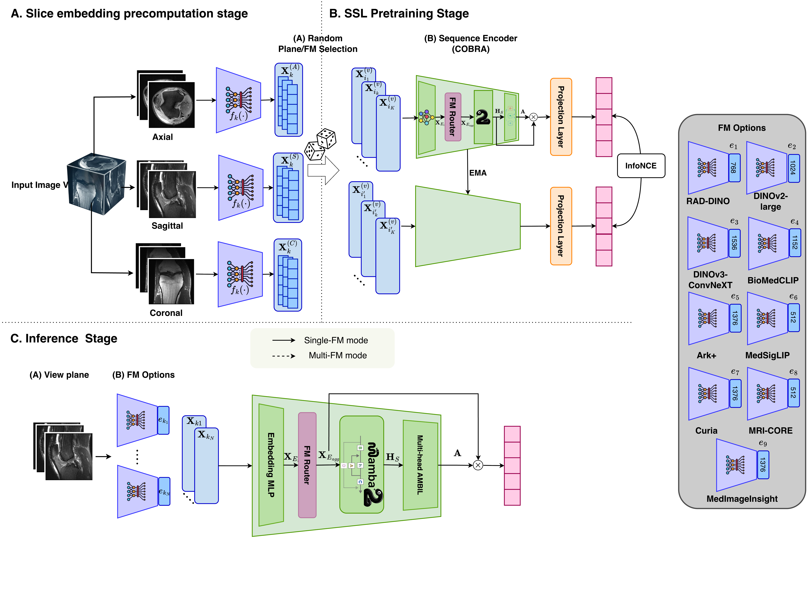
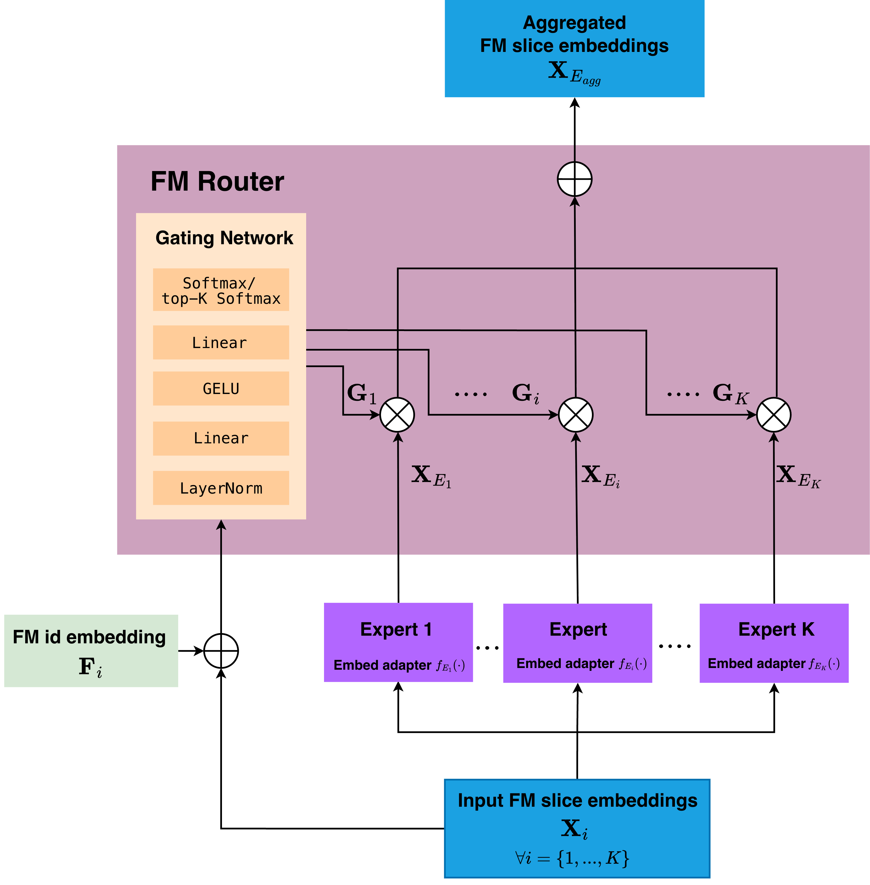

## Recall

Last time we discussed the broad direction of the publication and the next steps.
- [x] Task 1: MoE or multiple random passes (explainability, confidence score) 
- [x] Task 2: Compare MedSliM with MRNet / MST / 3DINO
- [ ] Task 3: Scale training data 
- [x] Task 4: How many foundation models needed?
- [x] Task 5: More anatomical regions
- [ ] Optiomal tasks: Look into interpretability by tracing back the slice weights in Mamba block and check RAPTOR performance and spatial tokens implementation if having spare time and space to put into the journal

## FM router implementation details

::: {.columns .router-diagram}

::: {.column width="35%"}

::: {.router-img-wrap}
{.router-overview fig-alt="MedSliM overview showing where the FM router sits in the full pipeline"}
:::

::: {.router-caption}
(a) End-to-end MedSliM routing pipeline
:::

:::

::: {.column width="65%"}

::: {.router-img-wrap}
{.router-detail fig-alt="Detailed router architecture with gating and aggregation"}
:::

::: {.router-caption}
(b) Detailed design of the per-slice FM router module
:::

:::

:::

