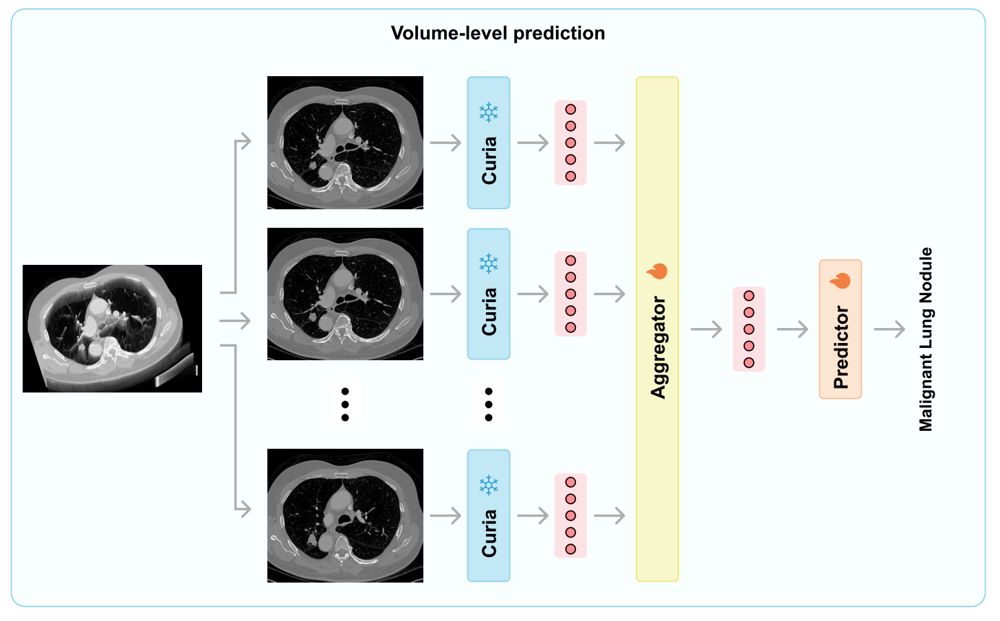
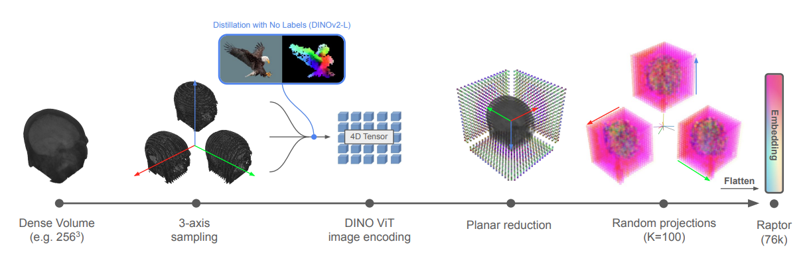

## Overview

- Comparison of MedSliM and Curia for MRNet and kneeMRI classification tasks.
- Raptor and potential improvements for MedSliM.
- Prioritization of the next steps for the publication.

---

## Compare MedSliM with Curia - Architecture Details

::: {.columns .arch-columns}

::: {.column width="55%"}

**MedSliM**

{.arch-medslim width=100%}

:::

::: {.column width="45%"}

**Curia**

{.arch-curia width=92%}

:::

:::

## Compare MedSliM with Curia — Results

<table class="compare-table">
  <thead>
    <tr>
      <th class="corner-cell"></th>
      <th colspan="2">AUROC</th>
    </tr>
    <tr>
      <th>Datasets</th>
      <th>MedSliM</th>
      <th>Curia</th>
    </tr>
  </thead>
  <tbody>
    <tr>
      <td>MRNet</td>
      <td>0.757</td>
      <td>0.731</td>
    </tr>
    <tr>
      <td>kneeMRI</td>
      <td>0.775</td>
      <td>0.746</td>
    </tr>
  </tbody>
</table>

::: {.slide-note}
Note: Curia uses DINOv2 pretrained on 200M CT/MRI slice images. The original paper uses the kneeMRI dataset to showcase the results, but only uses the central three slices to classify ACL tear severity.
:::

---

## What is Raptor?

::: {.arch-slide .raptor-slide}
{width="92%"}
:::

1. Raw input volume (256³, compressed)
2. Sample slices along all three orthogonal axes (axial, coronal, sagittal) → 3 × 256 slices total
3. Each slice uses a frozen DINOv2-L to extract patch token embeddings (16×16×1024 per slice)
4. Avg-pool across slices within each axis direction → 3 × 1024 × 16 × 16 tensor
5. Compresses dense patch tokens with random projections: $\mathbb{R} \in \mathbb{R}^{K \times 1024}, K << 1024$ (typically $K=100$) → 3 × K × 16 × 16 tensor
6. Raptor embedding $\mathbb{R} \in \mathbb{R}^{3 \times K \times 256} = \mathbb{R}^{76,800}$
7. Downstream: logistic regression or 3-layer MLP

---

## MedSliM Limitation

```text
Pretraining:
  sample one view per pair
  positive pair = same volume, same view, different FM / augmentation

Inference:
  z_sag, z_cor, z_ax -> late fusion logistic regression
```

- Multi-view information is never learned during SSL pretraining.
- Late fusion can only learn weak linear combinations of view embeddings during inference.
- Patch tokens from the 2D foundation models are currently discarded.

---

## Potential Improvement 1: Multi-View SSL

```text
Sagittal slices -> Mamba-2 -> z_sag
Coronal slices  -> Mamba-2 -> z_cor
Axial slices    -> Mamba-2 -> z_ax

[z_sag, z_cor, z_ax] -> cross-attention fusion -> z_vol

InfoNCE(z_vol_student, z_vol_teacher)
```

- Both SSL branches see all three views.
- Positive pairs compare fused multi-view volume embeddings.
- Cross-attention gives interpretable view weights.

---

## Potential Improvement 2: Spatial Tokens

```text
CLS token       -> Embed MLP -> Q 
16 x 16 patch tokens -> Pooling -> k x k -> Embed MLP -> K, V 
h_slice = Q + CrossAttention(Q, K, V)
h_slice -> Mamba-2
```

- Add spatial cross-attention after the Embed MLP.
- Spatial pooling gives precompute storage at manageable cost.

---

## Potential Improvement 3: FM-MoE

{width="75%"}


Inspired by Mixture-of-Experts (MoE) gated network:
```text
For each slice:
  h_DINOv2, h_RAD-DINO, h_Ark+, ...
       -> router -> weights over FMs
       -> weighted slice embedding
       -> Mamba-2
```

- Current MedSliM randomly samples one FM during SSL.
- FM-MoE learns which frozen FM is useful for each slice.
- Router weights are interpretable: which FM supports which anatomy/content?

---

## Proposed MedSliM Refinement Components

| Component | Current MedSliM | Proposed refinement |
|---|---|---|
| Views | single-view SSL, late fusion | multi-view SSL with cross-attention fusion |
| Spatial info | CLS only | CLS + compressed patch tokens with cross-attention |
| FM usage | random FM sampling | learned FM routing |

---

## Next steps

- Compare MedSliM with RAPTOR.
- Implement the proposed refinement for MedSliM? 
- Experiments on different anatomical regions (brain, lung, etc.) and modalities (CT/MRI)?
- More comprehensive comparison with other models?


